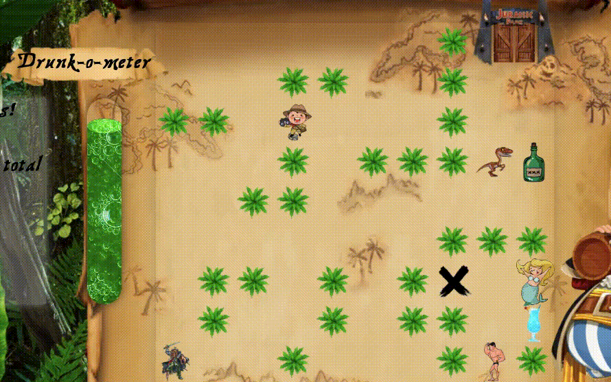

# Project 1

Project 1 on the GA Software Engineering Immersive course was to create a browser-based game using JavaScript.

I decided to make a Pirate game where you move pirate pete around the board and drink rum to collect points.

Please click [here](https://pea75x.github.io/GA-project-1/) to play my game.

## Timeframe

9 days

## Technologies Used

- HTML
- CSS (Animation)
- JavaScript
- Github

## Planning my game

I wanted my game to use a 10x10 table and collision detection for the edge of the board, trees, rum and other characters on the board.


## Steps in the game

The game has a progress bar known as a "drunkometer" which determines the result of the game. Once it reaches 100% the X position on the board becomes treasure. Once you have reached the treasure chest, the Jurrasic park gates open. The goal is to get to the open gates and enter the paleo pirate party.



## Characters

The game starts on the menu where you get to pick your character.

The game will then begin with the character you chose at the starting position on the board, and the other character on the right of the board. The character to your right will announce an array of clues that help you in the game.


## Moving Pete across the board

I started by creating an event listener for "keyup" which activated the playerMove function.

This first calculated where in the grid the player was on the x and y axis -

```
 const xPosition = player % width;
 const yPosition = Math.floor(player / width);
```

I then create an if function for each direction -

```
    //left
    if (event.keyCode === 37) {
      if (xPosition > 0 && !treeBash(player - 1)) {
        removeElement(player, whichPlayer);
        player--;
        addElement(player, whichPlayer);
      }
    }
```

If the user presses the left key, we remove the class from that position on the board, minus 1 from our position, and then add the class back to our position, provided we do not collide with the edge of our board (in this case xPosition > 0) or there are not any trees in the position we want to move to.

```
 function treeBash(futurePosition) {
    return trees.includes(futurePosition);
  }
```

## Moving characters

On the first level, all of the moving characters are on an array which moves them around the board in a set pattern within a set interval -

```
let raptorWalk = [28, 38, 48, 47, 46, 45, 46, 47, 48, 38, 28];
r = 0

 //** MOVE RAPTOR */
      if (r < raptorWalk.length - 1) {
        removeElement(raptorWalk[r], "raptor");
        r++;
        addElement(raptorWalk[r], "raptor");
      } else {
        removeElement(raptorWalk[r], "raptor");
        r = 0;
        addElement(raptorWalk[r], "raptor");
      }
```

In the next level I added a new character which can move in any direction on its own. This is done in a very similar way to Pete moving around the board -

```
let skull = 40;

          case "right":
            if (xPosition < width - 1 && !treeBash(skull + 1)) {
              removeElement(skull, "skull");
              skull++;
              addElement(skull, "skull");
            } else {
              changeDirection();
            }
            break;
```

In this example, if the skull is already going right it will keep going right unless it detects a collision. In this case, it will change direction.

```
      function changeDirection() {
        let randomNumber = Math.floor(Math.random() * 4);
        if (randomNumber === 0) {
          direction = "right";
        }
```

Using Math.random it randomly selects a number from 0 - 3 and is assigned a new direction this way.

## Winning the level

We can workout if the user has made it to the open gates by using this simple function -

```
  if (cells[player].classList.contains("openGates")) {
        clearInterval(badGuyTimer);
        win();
      }
```

The win function clears everything from the board and starts the next level.

## Losing the level

Once all of the rum is gone from the board and the user is under 100% points there is no point in keeping the game going so I have created a function that stops the game when this happens.

You can also stop the game when the drunkometer score goes below 0

## known bugs

## Future functionality

If I had more time I would have liked to add a secret cave passage that you could walk into and come out on another place on the board. I think this would be quite easy to implement by adding an if function to the player movements.
